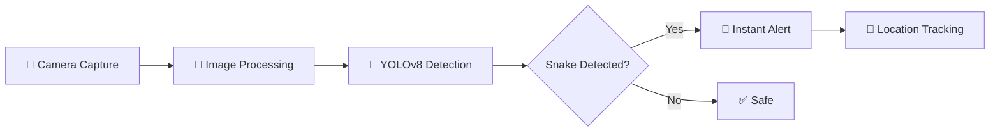

<div align="center">

# 🌾 SafeFarm: AI-Driven Farmer Protection System


### *Protecting Farmers with Real-Time AI Vision Technology*

[](https://flutter.dev)
[](https://dart.dev)
[](https://python.org)
[](https://github.com/ultralytics/ultralytics)
[](https://firebase.google.com)
[](LICENSE)

**[Features](#-key-features)** • **[Demo](#-screenshots)** • **[Installation](#-installation)** • **[Tech Stack](#-technology-stack)** • **[Contributing](#-contributing)**

---

</div>

## 🎯 Problem Statement

Every year, thousands of farmers worldwide face life-threatening encounters with snakes while working in agricultural fields. Manual detection is:
- ❌ **Slow and unreliable**
- ❌ **Extremely dangerous**
- ❌ **Dependent on human visibility and reaction time**

Traditional mobile solutions fail due to limited processing power and challenging field conditions (poor lighting, dense vegetation, varying terrain).

## 💡 The Solution

**SafeFarm** is an AI-powered mobile application that uses computer vision and deep learning to detect snakes in real-time through smartphone cameras, providing instant alerts to keep farmers safe while offering comprehensive agricultural support tools.

<div align="center">

### 🔄 How It Works



</div>

## ✨ Key Features

### 🐍 Real-Time Snake Detection
- **YOLOv8-powered** object detection trained on 2,000+ snake images
- **Live camera feed processing** with bounding box visualization
- **Instant alerts** with vibration and visual warnings
- **High accuracy** optimized for field conditions (brightness, contrast adjustment)
- **Species recognition** capability for future updates

### 🌤️ Live Weather Updates
- Real-time weather forecasts powered by **Open-Meteo API**
- 7-day weather predictions for planning
- Hourly updates for irrigation and planting decisions
- UV index and precipitation alerts
- Location-based weather insights

### 🤖 AI Farming Assistant (Chatbot)
- Answers queries about crops, techniques, and pest control
- Provides sustainable farming tips
- Powered by Google Gemini AI
- Multi-language support (6 Indian languages)
- Context-aware responses

### 🚑 Emergency First Aid Guidance
- Step-by-step instructions for snakebites
- Treatment for cuts, stings, and farm injuries
- Offline access to critical information
- Visual guides with illustrations

### 📚 Educational Resources
- Best practices for sustainable farming
- Soil health management tips
- Seasonal planning guides
- Crop rotation strategies
- Pest management techniques

### 📊 Insights & Analytics
- Farming activity tracking
- Detection history logs
- Weather pattern analysis
- Personalized recommendations

## 🏗️ Technology Stack

### Frontend (Mobile App)
- **Framework:** Flutter 3.7.2+
- **Language:** Dart 3.7+
- **State Management:** Provider
- **UI/UX:** Material Design 3
- **Animations:** Flutter Animate
- **Camera:** Camera plugin

### Backend & AI/ML
- **Object Detection:** YOLOv8 (Ultralytics)
- **ML Framework:** TensorFlow, PyTorch
- **Computer Vision:** OpenCV
- **Training Platform:** Google Colab (Cloud GPU)
- **Language:** Python 3.8+

### Cloud & APIs
- **Authentication:** Firebase Auth
- **Database:** Cloud Firestore
- **Storage:** Firebase Storage
- **Weather API:** Open-Meteo (Free & Open Source)
- **AI Assistant:** Google Gemini AI
- **Push Notifications:** Firebase Cloud Messaging

### Development Tools
- **Version Control:** Git
- **IDE:** Android Studio, VS Code
- **Build Tools:** Gradle
- **Package Manager:** pub, pip

## 📋 System Requirements

### For Development
- **OS:** Windows 10/11, macOS, or Linux
- **Processor:** Intel Core i5+ (8th Gen or higher)
- **RAM:** 8 GB minimum (16 GB recommended)
- **Storage:** 100 GB free space (SSD recommended)
- **GPU:** Optional but recommended for ML training

### For Running the App
- **OS:** Android 5.0+ (API Level 21+)
- **RAM:** 3 GB minimum
- **Camera:** 8 MP+ with autofocus
- **Storage:** 200 MB free space
- **Network:** Internet connection for cloud features

## 🚀 Installation

### Prerequisites
```bash
# Install Flutter SDK
# Visit: https://docs.flutter.dev/get-started/install

# Verify installation
flutter doctor

# Install Git
# Visit: https://git-scm.com/downloads
```

### Clone the Repository
```bash
git clone https://github.com/Ghost24into7/SafeFarm.git
cd SafeFarm
```

### Configure API Keys
⚠️ **IMPORTANT:** This project requires API configuration before running.

1. **Firebase Setup:**
   - Create a Firebase project at [Firebase Console](https://console.firebase.google.com/)
   - Download `google-services.json`
   - Place it in `android/app/`

2. **Google Gemini AI:**
   - Get API key from [Google AI Studio](https://makersuite.google.com/app/apikey)
   - Update in `lib/screens/chatbot_screen.dart` and `lib/screens/forecast_screen.dart`

3. **Backend Server:**
   - Configure your server IP in `lib/services/api_service.dart`
   - Or set it via Settings screen in the app

📖 **Detailed instructions:** See [API_CONFIGURATION_GUIDE.md](API_CONFIGURATION_GUIDE.md)

### Install Dependencies
```bash
flutter pub get
```

### Run the Application
```bash
# For Android
flutter run

# For release build
flutter build apk --release
```

## 🧪 Running Tests
```bash
# Run all tests
flutter test

# Run with coverage
flutter test --coverage

# Run specific test file
flutter test test/widget_test.dart
```

## 📁 Project Structure
```
safefarm/
├── android/              # Android native code
├── assets/               # Images, fonts, and resources
├── ios/                  # iOS native code
├── lib/
│   ├── main.dart        # App entry point
│   ├── models/          # Data models
│   ├── screens/         # UI screens
│   │   ├── home_screen.dart
│   │   ├── chatbot_screen.dart
│   │   ├── forecast_screen.dart
│   │   ├── image_detection_screen.dart
│   │   └── live_detection_screen.dart
│   ├── services/        # API services
│   │   └── api_service.dart
│   ├── widgets/         # Reusable components
│   └── providers/       # State management
├── test/                # Test files
├── pubspec.yaml         # Dependencies
└── README.md           # This file
```

## 🔬 ML Model Training

The YOLOv8 model was trained on:
- **Dataset:** 2,000+ annotated snake images
- **Classes:** Multiple snake species (expandable)
- **Training Platform:** Google Colab with GPU acceleration
- **Frameworks:** PyTorch, Ultralytics YOLOv8
- **Preprocessing:** Image augmentation, normalization, resizing

### Model Performance
- **Inference Speed:** ~50-100ms per frame
- **Accuracy:** High precision optimized for field conditions
- **Model Size:** Optimized for mobile deployment

## 🌍 Future Roadmap

- [ ] **Expand Detection:** Add scorpions, harmful insects, and other threats
- [ ] **Species Classification:** Identify venomous vs non-venomous snakes
- [ ] **Risk Mapping:** Location-based snake encounter heatmaps
- [ ] **Offline Mode:** Core features available without internet
- [ ] **Multi-platform:** iOS and Web versions
- [ ] **Community Features:** Farmer forums and knowledge sharing
- [ ] **IoT Integration:** Smart farm sensors and automation
- [ ] **Voice Commands:** Hands-free operation for field use
- [ ] **AR Overlay:** Augmented reality snake detection visualization

## 🤝 Contributing

We welcome contributions! Here's how you can help:

1. **Fork the repository**
2. **Create a feature branch:** `git checkout -b feature/AmazingFeature`
3. **Commit your changes:** `git commit -m 'Add some AmazingFeature'`
4. **Push to the branch:** `git push origin feature/AmazingFeature`
5. **Open a Pull Request**

### Contribution Guidelines
- Follow Flutter/Dart style guide
- Write clear commit messages
- Add tests for new features
- Update documentation as needed
- Respect code of conduct

## 📄 License

This project is licensed under the MIT License 

## 👥 Authors

- **Ghost24into7** - *Initial Development* - [GitHub](https://github.com/Ghost24into7)

## 🙏 Acknowledgments

- **YOLOv8** by Ultralytics for object detection framework
- **Open-Meteo** for free weather API
- **Google** for Gemini AI and Firebase services
- **Flutter Team** for the amazing framework
- All contributors and testers

## ⭐ Star History

If you find this project useful, please consider giving it a ⭐!

[](https://star-history.com/#Ghost24into7/SafeFarm&Date)

---

<div align="center">

### 🌱 *Making Agriculture Safer, One Detection at a Time*

**SafeFarm** - A practical, scalable AI safety shield for agriculture.

Made with ❤️ by farmers, for farmers.

</div>
